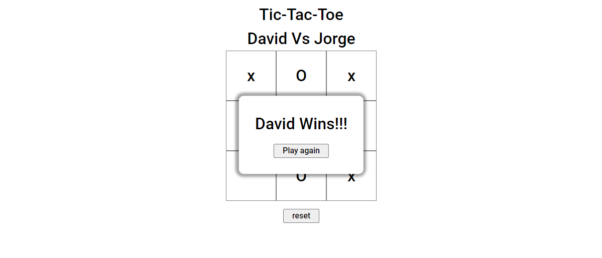

# This is a Tic-Tac-Toe Game

You can play with a friend or by yourself, there are not limits to this game, except on the number of possible moves. What number is that you might ask, and I'm honored to say that I don't know. 

Play it [here](https://parzivalcen.github.io/TicTacToe_Odin/)

In this project I learned about modules and factory functions, although they still need to be more polished, It was definitely hard to solve all the problems of this little seemed project, but it was a trill building it. 
